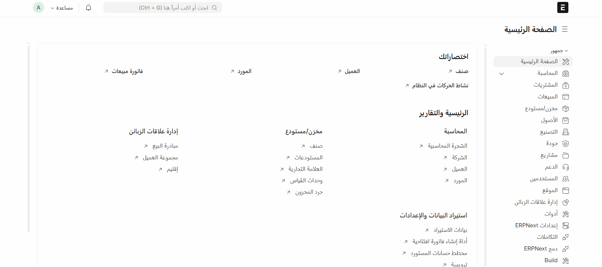

# In-Context Custom Translation for Frappe Apps

A Frappe app that provides **fast in-context custom translation** for Frappe apps.  
With this app, you can translate text directly from the user interface without switching screens or searching for the source text.

## ✨ Features

- **In-Context Editing**: Edit translations directly on the page where the text appears.
- **Quick Translation Dialog**: Instantly add or update translations with an easy-to-use popup.
- **Optional Context Support**: Control whether a translation is saved with specific context.
- **Wide Coverage**: Works with Workspace, Sidebar, Forms, and other common UI areas.
- **Multi-Language Ready**: Designed to work with any language supported by Frappe.

## 📦 Installation

1. Navigate to your Frappe Bench directory.
2. Get the app:
   ```bash
   bench get-app https://github.com/Mazen-Almortada/incontext_translation.git
   ```

3. Install the app on your site:

   ```bash
   bench --site yoursite.local install-app incontext_translation
   ```
4. Build and clear cache:

   ```bash
   bench build
   bench --site yoursite.local clear-cache
   ```

## 🚀 Demo



## 🔧 Configuration

**Permissions**: Only **System Manager** or **Translation Editor** roles can use this feature.

**Customization**: You can extend the list of selectors in `translation_mode.js` to target more elements.

## 🪪 License

**MIT License**